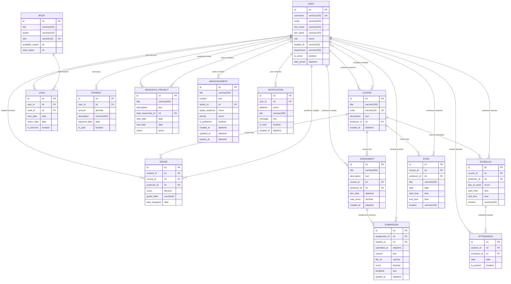

```mermaid
erDiagram
    %% Core Entities
    USER {
        id int PK
        username varchar(150) UK
        email varchar(254)
        first_name varchar(150)
        last_name varchar(150)
        role enum
        student_id varchar(20)
        department varchar(100)
        is_active boolean
        date_joined datetime
    }

    COURSE {
        id int PK
        title varchar(200)
        code varchar(20) UK
        description text
        professor_id int FK
        created_at datetime
    }

    GRADE {
        id int PK
        student_id int FK
        course_id int FK
        professor_id int FK
        score decimal
        grade_letter varchar(2)
        date_assigned date
    }

    ASSIGNMENT {
        id int PK
        title varchar(200)
        description text
        course_id int FK
        professor_id int FK
        due_date datetime
        max_score decimal
        created_at datetime
    }

    SUBMISSION {
        id int PK
        assignment_id int FK
        student_id int FK
        submitted_at datetime
        content text
        file_url varchar
        score decimal
        feedback text
        graded_at datetime
    }

    SCHEDULE {
        id int PK
        course_id int FK
        professor_id int FK
        day_of_week enum
        start_time time
        end_time time
        location varchar(100)
    }

    ATTENDANCE {
        id int PK
        student_id int FK
        schedule_id int FK
        date date
        is_present boolean
    }

    EXAM {
        id int PK
        course_id int FK
        professor_id int FK
        title varchar(200)
        date date
        start_time time
        end_time time
        location varchar(100)
    }

    BOOK {
        id int PK
        title varchar(200)
        author varchar(100)
        isbn varchar(13) UK
        available_copies int
        total_copies int
    }

    LOAN {
        id int PK
        user_id int FK
        book_id int FK
        loan_date date
        return_date date
        is_returned boolean
    }

    PAYMENT {
        id int PK
        user_id int FK
        amount decimal
        description varchar(200)
        payment_date date
        is_paid boolean
    }

    RESEARCH_PROJECT {
        id int PK
        title varchar(200)
        description text
        lead_researcher_id int FK
        start_date date
        end_date date
        status enum
    }

    ANNOUNCEMENT {
        id int PK
        title varchar(200)
        content text
        author_id int FK
        target_audience enum
        priority enum
        is_published boolean
        created_at datetime
        updated_at datetime
        expires_at datetime
    }

    NOTIFICATION {
        id int PK
        user_id int FK
        platform enum
        title varchar(200)
        message text
        is_read boolean
        created_at datetime
    }

    %% Relationships
    USER ||--o{ COURSE : "professor teaches"
    USER }o--o{ COURSE : "students enrolled"
    
    USER ||--o{ GRADE : "student receives"
    COURSE ||--o{ GRADE : "course has"
    USER ||--o{ GRADE : "professor assigns"
    
    USER ||--o{ ASSIGNMENT : "professor creates"
    COURSE ||--o{ ASSIGNMENT : "course has"
    
    ASSIGNMENT ||--o{ SUBMISSION : "assignment receives"
    USER ||--o{ SUBMISSION : "student submits"
    
    COURSE ||--o{ SCHEDULE : "course scheduled"
    USER ||--o{ SCHEDULE : "professor teaches"
    
    USER ||--o{ ATTENDANCE : "student attends"
    SCHEDULE ||--o{ ATTENDANCE : "schedule tracked"
    
    COURSE ||--o{ EXAM : "course has"
    USER ||--o{ EXAM : "professor conducts"
    
    USER ||--o{ LOAN : "user borrows"
    BOOK ||--o{ LOAN : "book loaned"
    
    USER ||--o{ PAYMENT : "user pays"
    
    USER ||--o{ RESEARCH_PROJECT : "researcher leads"
    USER }o--o{ RESEARCH_PROJECT : "team members"
    
    USER ||--o{ ANNOUNCEMENT : "author creates"
    
    USER ||--o{ NOTIFICATION : "user receives"
```
