```mermaid
erDiagram
    %% Core User Entity
    USER {
        id uuid PK
        username varchar(150) UK
        email varchar(254)
        first_name varchar(150)
        last_name varchar(150)
        role enum
        gender enum
        is_active boolean
    }

    %% Dormitory Entities
    DORMITORY_COMPLEX {
        id uuid PK
        name varchar(200)
        name_en varchar(200)
        code varchar(20) UK
        gender enum
        address text
        phone varchar(20)
        manager_id uuid FK
        is_active boolean
        established_date date
        facilities json
        rules json
        created_at datetime
        updated_at datetime
    }

    DORMITORY_BUILDING {
        id uuid PK
        complex_id uuid FK
        name varchar(100)
        code varchar(20)
        floor_count int
        construction_year int
        total_area int
        is_active boolean
        maintenance_status enum
        has_elevator boolean
        has_laundry boolean
        has_kitchen boolean
        has_study_room boolean
        has_prayer_room boolean
        supervisor_id uuid FK
        created_at datetime
        updated_at datetime
    }

    DORMITORY_FLOOR {
        id uuid PK
        building_id uuid FK
        floor_number int
        name varchar(50)
        supervisor_id uuid FK
        has_common_room boolean
        has_kitchen boolean
        has_bathroom boolean
        is_active boolean
        description text
        created_at datetime
        updated_at datetime
    }

    DORMITORY_ROOM {
        id uuid PK
        floor_id uuid FK
        room_number varchar(10)
        room_code varchar(50) UK
        room_type enum
        capacity int
        area int
        status enum
        is_active boolean
        has_private_bathroom boolean
        has_balcony boolean
        has_air_conditioning boolean
        has_heating boolean
        has_internet boolean
        academic_level_restriction json
        min_gpa decimal
        special_conditions json
        monthly_rent decimal
        deposit decimal
        description text
        maintenance_notes text
        created_at datetime
        updated_at datetime
    }

    DORMITORY_ACCOMMODATION {
        id uuid PK
        student_id uuid FK
        room_id uuid FK
        start_date date
        end_date date
        actual_end_date date
        status enum
        is_active boolean
        monthly_payment decimal
        deposit_paid decimal
        approved_by_id uuid FK
        approved_at datetime
        application_notes text
        admin_notes text
        termination_reason text
        created_at datetime
        updated_at datetime
    }

    DORMITORY_STAFF {
        id uuid PK
        user_id uuid FK
        complex_id uuid FK
        building_id uuid FK
        role enum
        shift enum
        start_date date
        end_date date
        is_active boolean
        emergency_contact json
        notes text
        created_at datetime
        updated_at datetime
    }

    DORMITORY_MAINTENANCE {
        id uuid PK
        room_id uuid FK
        reported_by_id uuid FK
        assigned_to_id uuid FK
        title varchar(200)
        description text
        priority enum
        category enum
        status enum
        reported_at datetime
        assigned_at datetime
        started_at datetime
        completed_at datetime
        estimated_cost decimal
        actual_cost decimal
        admin_notes text
        technician_notes text
        completion_notes text
        updated_at datetime
    }

    %% Relationships
    
    %% User relationships
    USER ||--o{ DORMITORY_COMPLEX : "manages"
    USER ||--o{ DORMITORY_BUILDING : "supervises"
    USER ||--o{ DORMITORY_FLOOR : "supervises"
    USER ||--o{ DORMITORY_ACCOMMODATION : "student"
    USER ||--o{ DORMITORY_ACCOMMODATION : "approved_by"
    USER ||--o{ DORMITORY_STAFF : "staff_member"
    USER ||--o{ DORMITORY_MAINTENANCE : "reported_by"
    USER ||--o{ DORMITORY_MAINTENANCE : "assigned_to"

    %% Hierarchical relationships
    DORMITORY_COMPLEX ||--o{ DORMITORY_BUILDING : "contains"
    DORMITORY_BUILDING ||--o{ DORMITORY_FLOOR : "contains"
    DORMITORY_FLOOR ||--o{ DORMITORY_ROOM : "contains"
    DORMITORY_ROOM ||--o{ DORMITORY_ACCOMMODATION : "hosts"
    DORMITORY_ROOM ||--o{ DORMITORY_MAINTENANCE : "requires"

    %% Staff relationships
    DORMITORY_COMPLEX ||--o{ DORMITORY_STAFF : "employs"
    DORMITORY_BUILDING ||--o{ DORMITORY_STAFF : "assigned_to"
```

# 🏠 نمودار ER سیستم مدیریت خوابگاه



## 🔍 توضیحات روابط

### 🏢 **ساختار سلسله‌مراتبی**
```
University
  └── DormitoryComplex (Gender Separated)
      └── DormitoryBuilding (Multiple buildings per complex)
          └── DormitoryFloor (Multiple floors per building)
              └── DormitoryRoom (Multiple rooms per floor)
                  └── DormitoryAccommodation (Students living in rooms)
```

### 👥 **روابط مدیریتی**

#### **مدیران و سرپرستان**:
- **Complex Manager**: یک مدیر برای هر مجموعه خوابگاهی
- **Building Supervisor**: یک سرپرست برای هر ساختمان
- **Floor Supervisor**: یک سرپرست اختیاری برای هر طبقه

#### **کارکنان**:
- هر کارمند به یک مجموعه خوابگاهی تعلق دارد
- ممکن است به ساختمان خاصی اختصاص یابد
- نقش‌های مختلف: مدیر، سرپرست، نگهبان، نظافتچی، تعمیرکار

### 🏠 **مدیریت اسکان**

#### **قوانین اسکان**:
1. هر دانشجو می‌تواند چندین اسکان داشته باشد (تاریخی)
2. در هر زمان فقط یک اسکان فعال
3. جنسیت دانشجو باید با جنسیت خوابگاه مطابقت داشته باشد
4. ظرفیت اتاق نباید تجاوز شود

#### **وضعیت‌های اسکان**:
- `PENDING`: در انتظار تأیید
- `APPROVED`: تأیید شده اما شروع نشده
- `ACTIVE`: در حال سکونت
- `SUSPENDED`: تعلیق موقت
- `TERMINATED`: خاتمه یافته
- `CANCELLED`: لغو شده

### 🔧 **سیستم نگهداری**

#### **فرآیند تعمیرات**:
1. **گزارش**: کاربر مشکل را گزارش می‌دهد
2. **بررسی**: مدیر درخواست را بررسی می‌کند
3. **محولی**: به تعمیرکار مناسب محول می‌شود
4. **اجرا**: تعمیرکار کار را شروع می‌کند
5. **تکمیل**: کار تمام شده و گزارش ارائه می‌شود

#### **اولویت‌بندی**:
- `URGENT`: فوری (ایمنی، برق، گاز)
- `HIGH`: زیاد (آب، گرمایش)
- `MEDIUM`: متوسط (مبلمان)
- `LOW`: کم (زیبایی)

### 📊 **ایندکس‌ها و بهینه‌سازی**

#### **ایندکس‌های عملکردی**:
```sql
-- جستجوی سریع اتاق‌ها
CREATE INDEX idx_room_code ON dormitory_room(room_code);
CREATE INDEX idx_room_status ON dormitory_room(status);
CREATE INDEX idx_room_type ON dormitory_room(room_type);

-- فیلتر اسکان‌ها
CREATE INDEX idx_accommodation_student_status ON dormitory_accommodation(student_id, status);
CREATE INDEX idx_accommodation_dates ON dormitory_accommodation(start_date, end_date);

-- درخواست‌های تعمیرات
CREATE INDEX idx_maintenance_status_priority ON dormitory_maintenance(status, priority);
CREATE INDEX idx_maintenance_reported_at ON dormitory_maintenance(reported_at);

-- جداسازی جنسیت
CREATE INDEX idx_complex_gender ON dormitory_complex(gender);
```

#### **Unique Constraints**:
```sql
-- هر ساختمان کد منحصر به فرد در مجموعه خود
UNIQUE(complex_id, code) on dormitory_building

-- هر طبقه شماره منحصر به فرد در ساختمان خود  
UNIQUE(building_id, floor_number) on dormitory_floor

-- هر اتاق شماره منحصر به فرد در طبقه خود
UNIQUE(floor_id, room_number) on dormitory_room

-- کد اتاق در کل سیستم منحصر به فرد
UNIQUE(room_code) on dormitory_room
```

### 🎯 **محدودیت‌های تجاری (Business Rules)**

#### **جداسازی جنسیت**:
- مجموعه خوابگاهی فقط یک جنسیت
- مدیر مجموعه باید هم‌جنس باشد
- دانشجو فقط در خوابگاه هم‌جنس خود

#### **مدیریت ظرفیت**:
- تعداد ساکنان نباید از ظرفیت اتاق تجاوز کند
- ظرفیت بر اساس نوع اتاق محدود شده
- Single: 1، Double: 2، Triple: 3، Quad: 4، Suite: 6

#### **کنترل دسترسی**:
- دانشجو فقط اسکان‌های خود را می‌بیند
- مدیر فقط مجموعه خود را مدیریت می‌کند
- سرپرست فقط ساختمان/طبقه خود را می‌بیند

---

## 📈 آمار و ظرفیت

### **تخمین حجم داده‌ها (دانشگاه 10,000 نفره)**:
- **DormitoryComplex**: ~4 رکورد (2 برادران + 2 خواهران)
- **DormitoryBuilding**: ~20 رکورد (5 ساختمان در هر مجموعه)
- **DormitoryFloor**: ~80 رکورد (4 طبقه در هر ساختمان)
- **DormitoryRoom**: ~1,600 رکورد (20 اتاق در هر طبقه)
- **DormitoryAccommodation**: ~8,000 رکورد (تاریخی)
- **DormitoryStaff**: ~100 رکورد
- **DormitoryMaintenance**: ~5,000 رکورد (سالانه)

### **محاسبات ظرفیت**:
```python
# محاسبه ظرفیت کل
total_capacity = sum(
    room.capacity 
    for complex in dormitory_complexes
    for building in complex.buildings
    for floor in building.floors  
    for room in floor.rooms
    if room.is_active
)

# نرخ اشغال
occupancy_rate = current_residents / total_capacity * 100
```
